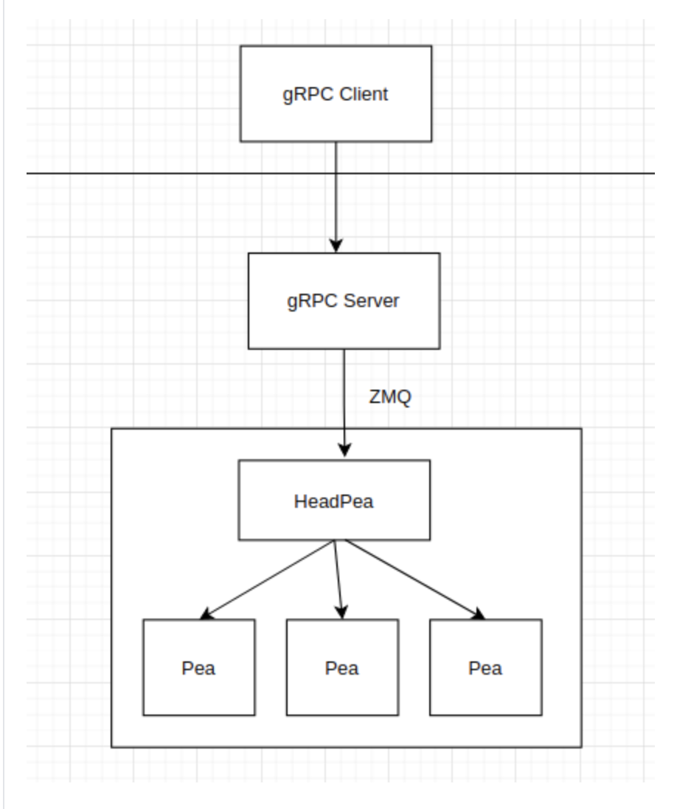

# Read Me

This is the read me for gRPC. We just wanna create a similar structure to Jina for learning purposes. The gRPC part, we learnt from this tutorial. 
https://towardsdatascience.com/implementing-grpc-server-using-python-9dc42e8daea0

ZMQ from the official website  https://learning-0mq-with-pyzmq.readthedocs.io/en/latest/pyzmq/patterns/pushpull.html

## Introduction

1. gRPC client: Only as gRPC client, sending message to gRPC Server to request certain mission.

2. gRPC Server: Also as ZMQ request (corresponding with Head Pea, ZMQ Client), ZMQ Result Collector (in ZMQ Push / Pull Model).

   gRPC Server will receive a request from gRPC Client and send the another request to Head Pea and receive the message from Body Pea

3. Head Pea: Also as a ZMQ client and Producer (in ZMQ Push / Pull Model). When receiving the message from the gRPC Server, Head Pea will push the message into consumer (Body Pea).

4. Body Pea: Consumer (in ZMQ Push / Pul Model), will send the message to result collector.

## Pipeline:

~~~shell
cd gRPC_jina
~~~

1. Init gRPC Server

~~~shell
python blueprint
~~~

2. Init Head Pea

~~~shell
python HeadPea.py
~~~

3. Init Body Pea

~~~shell
python BodyPea.py
~~~

4. Init gRPC Client and sending message

~~~shell
python -m blueprint.client
~~~

And we will see the result showing!!!

